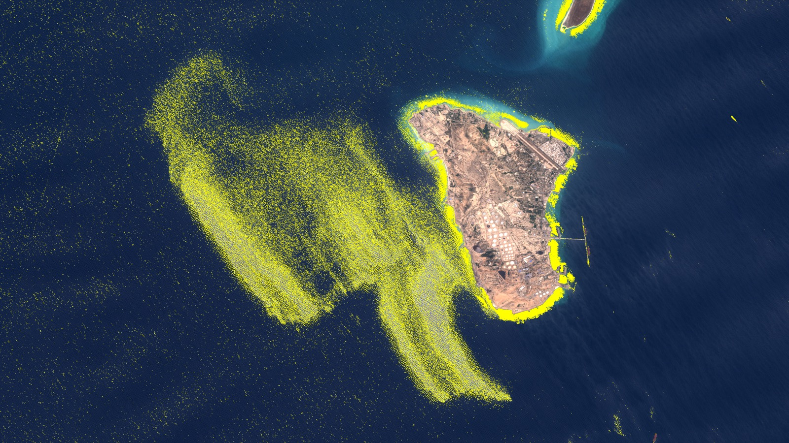

# GEE Sentinel-2 OSI Cloud Probability Template

Google Earth Engine JavaScript scripts for screening Sentinel-2 imagery for candidate optical anomalies that may be consistent with possible sea-surface oil slick signatures.

Sentinel-2 画像から、海面油膜の光学的特徴と整合する可能性のある候補異常を抽出するための Google Earth Engine JavaScript スクリプトです。



Example visual preview near Kharg Island on 2026-05-06. Yellow pixels indicate candidate optical anomalies, not confirmed oil pollution.

2026年5月6日の Kharg Island 周辺の表示例です。黄色のピクセルは光学的な候補異常であり、油汚染を確定するものではありません。

## Research Context / 研究背景

This repository was prepared as part of the joint research project "Updating Reporting Methods with Advanced Technologies" between Hidenori Watanave Laboratory at the University of Tokyo Graduate School and Nippon TV.

このリポジトリは、東京大学大学院 渡邉英徳研究室と日本テレビとの共同研究「先端技術を活用した報道手法のアップデート」の一環として整備したものです。

## Important Caution / 重要な注意

This workflow does not confirm oil pollution. It only extracts candidate optical anomalies that may be consistent with possible oil slick signatures. Independent validation is strongly recommended using SAR imagery, AIS/vessel records, wind/current data, time-series imagery, and local or official reporting.

このワークフローは油汚染を確定するものではありません。海面油膜の特徴と整合する可能性のある光学的な候補異常を抽出するだけです。SAR 画像、AIS・船舶記録、風・海流データ、時系列画像、現地情報や公的報告などによる独立検証を強く推奨します。

## Repository Contents / リポジトリ構成

| Path | Description |
| --- | --- |
| `gee/sentinel2_osi_cloud_probability_template.js` | Reusable Google Earth Engine Code Editor template; users must replace `siteName` and AOI |
| `gee/examples/kharg_20260506_example.js` | Ready-to-run Kharg Island focused-AOI example for 2026-05-06 |
| `assets/thumbnail_20260506.jpg` | README thumbnail image |
| `LICENSE.md` | Suggested licensing: MIT for code, CC BY 4.0 for documentation/figures |
| `SHARE_POSTS.md` | Short text for sharing the repository |

## English Guide

### What The Script Does

The script processes Sentinel-2 imagery over a user-defined AOI and a single analysis date in the Google Earth Engine Code Editor.

It uses:

- `COPERNICUS/S2_HARMONIZED`
- `COPERNICUS/S2_CLOUD_PROBABILITY`
- NDWI water masking
- Oil Spill Index: `OSI = (B03 + B04) / B02`
- OSI anomaly: `OSI anomaly = OSI - local mean OSI`
- Sentinel-2 Cloud Probability to suppress cloud-related false positives
- Google Drive GeoTIFF exports

Sentinel-2 and Cloud Probability collections are not joined by `system:index`; they are mosaicked separately for stability.

### Quick Start

1. Open the [Google Earth Engine Code Editor](https://code.earthengine.google.com/).
2. Copy the contents of `gee/sentinel2_osi_cloud_probability_template.js`.
3. Paste the script into a new Earth Engine script.
4. Edit the settings at the top of the file.
5. Replace the placeholder AOI polygon.
6. Click `Run`.
7. Review the map layers and Console output.
8. Start the export tasks from the `Tasks` tab.

For the Kharg Island example, use:

```text
gee/examples/kharg_20260506_example.js
```

### Replace The AOI

Replace the `aoi` geometry block in the script:

```javascript
var aoi = ee.Geometry({
  'type': 'Polygon',
  'coordinates': [[
    [lon1, lat1],
    [lon2, lat2],
    [lon3, lat3],
    [lon1, lat1]
  ]]
});
```

GeoJSON-style polygons copied from tools such as Planet Insight Browser, QGIS, or geojson.io can be pasted here.

The template file contains only a small placeholder polygon near `0,0`; replace it before analysis. The Kharg Island AOI is provided in the example script.

### Change The Date

Change only `analysisDate`:

```javascript
var analysisDate = '2026-05-06';
```

The script automatically creates `start`, `end`, `dateTag`, `dateLabel`, `exportPrefix`, and `layerSuffix`. The analysis uses one calendar day. In Earth Engine, `filterDate(start, end)` treats `end` as exclusive, so the script automatically sets `end` to the next day.

### Parameter Guide

| Parameter | Meaning | Default |
| --- | --- | --- |
| `siteName` | Short name used in map layers and export filenames | `Your_Site_Name` |
| `analysisDate` | Single date to process, `YYYY-MM-DD` | `2026-05-06` |
| `exportFolder` | Google Drive export folder | `GEE_OSI_exports` |
| `sceneCloudMax` | Maximum Sentinel-2 scene cloud percentage | `80` |
| `cloudProbabilityMax` | Pixel-level Cloud Probability cutoff for retaining candidates | `85` |
| `ndwiThreshold` | NDWI threshold for water masking | `0.05` |
| `osiAnomalyThreshold` | Absolute OSI anomaly threshold for candidate extraction | `0.15` |
| `localMeanRadiusMeters` | Half-width of the square window used to compute local mean OSI | `500` |
| `trueColorMin` | True-color visualization minimum | `0` |
| `trueColorMax` | True-color visualization maximum | `0.3` |
| `trueColorGamma` | Gamma correction for true-color visualization | `1.0` |
| `trueColorBrightness` | Brightness multiplier for the true-color background | `0.85` |
| `oilOpacity` | Opacity of candidate overlay | `1.0` |

Adjustment notes:

- If oil candidates are removed too aggressively, raise `cloudProbabilityMax` to `90` or `95`.
- If cloud false positives remain, lower `cloudProbabilityMax` to `70` or `75`.
- If too many candidates appear, raise `osiAnomalyThreshold` to `0.18` or `0.20`.
- If too few candidates appear, lower `osiAnomalyThreshold` to `0.10` or `0.08`.
- To make oil candidates stand out more, lower `trueColorBrightness` to `0.75` or `0.8`, or raise `trueColorMax` to `0.35` or `0.4`.
- Adjust `localMeanRadiusMeters` as needed. Larger values can slow `Mask` and `TrueColor` exports.
- Lower `ndwiThreshold` to `0.0` if the water mask is too strict.

### Export Outputs

Default exports:

| Output | Example filename | Purpose |
| --- | --- | --- |
| True color + oil candidate visual preview | `Kharg_NTV_Whole_OSI_20260506_TrueColor.tif` | Visual review and reporting preview |
| Binary oil candidate mask | `Kharg_NTV_Whole_OSI_20260506_Mask.tif` | 0/1 analysis mask |
| Cloud probability | `Kharg_NTV_Whole_OSI_20260506_CloudProbability.tif` | Cloud-filter validation |
| Natural color only | `Kharg_NTV_Whole_OSI_20260506_NaturalColor.tif` | Visual comparison and publication context |

Optional exports are included but commented out by default:

- `OSI anomaly`
- `NDWI`

### Scientific Limitations

This script is a screening and triage aid, not standalone evidence. False positives may come from cloud edges, haze, sunglint, sediment, algal blooms, water-depth effects, compression or mosaicking artifacts, sensor/viewing geometry, and other non-oil surface phenomena.

### Citation / Reference

Rajendran et al. (2021), "Oil Spill Index (OSI) to Sentinel-2 Satellite Data." DOI: `10.29117/quarfe.2021.0020`

### Credits And License

This workflow uses Google Earth Engine, Copernicus Sentinel-2 imagery, and Sentinel-2 Cloud Probability data. The OSI concept follows the Rajendran et al. reference above.

Suggested licensing:

- Code: MIT License
- Documentation and figures, if applicable: CC BY 4.0

See `LICENSE.md`.

## 日本語ガイド

### このスクリプトが行うこと

このスクリプトは、Google Earth Engine Code Editor 上で、指定した AOI と解析日について Sentinel-2 画像を処理します。

使用する主な要素:

- `COPERNICUS/S2_HARMONIZED`
- `COPERNICUS/S2_CLOUD_PROBABILITY`
- NDWI による水域マスク
- Oil Spill Index: `OSI = (B03 + B04) / B02`
- OSI anomaly: `OSI anomaly = OSI - local mean OSI`
- Sentinel-2 Cloud Probability による雲由来の偽陽性抑制
- Google Drive への GeoTIFF 出力

Sentinel-2 と Cloud Probability は `system:index` で join せず、それぞれ別々に mosaic します。

### クイックスタート

1. [Google Earth Engine Code Editor](https://code.earthengine.google.com/) を開きます。
2. `gee/sentinel2_osi_cloud_probability_template.js` の内容をコピーします。
3. Earth Engine の新規スクリプトに貼り付けます。
4. ファイル冒頭の設定を編集します。
5. placeholder の AOI polygon を置き換えます。
6. `Run` を押します。
7. 地図レイヤと Console 出力を確認します。
8. `Tasks` タブから export task を開始します。

Kharg Island の例は次のファイルです。

```text
gee/examples/kharg_20260506_example.js
```

### AOI の置き換え方

スクリプト内の `aoi` geometry ブロックを置き換えます。

```javascript
var aoi = ee.Geometry({
  'type': 'Polygon',
  'coordinates': [[
    [lon1, lat1],
    [lon2, lat2],
    [lon3, lat3],
    [lon1, lat1]
  ]]
});
```

Planet Insight Browser、QGIS、geojson.io などからコピーした GeoJSON 形式の polygon を貼り付けることができます。

template ファイルには `0,0` 付近の小さな placeholder polygon だけが入っています。解析前に必ず置き換えてください。Kharg Island の AOI は example スクリプトに入っています。

### 日付の変更方法

変更するのは `analysisDate` だけです。

```javascript
var analysisDate = '2026-05-06';
```

`start`、`end`、`dateTag`、`dateLabel`、`exportPrefix`、`layerSuffix` は自動生成されます。解析対象は 1 日です。Earth Engine の `filterDate(start, end)` では `end` が排他的なので、スクリプト内で自動的に翌日を `end` に設定します。

### パラメータガイド

| パラメータ | 意味 | デフォルト |
| --- | --- | --- |
| `siteName` | レイヤ名と出力ファイル名に使う短い名称 | `Your_Site_Name` |
| `analysisDate` | 解析日、`YYYY-MM-DD` | `2026-05-06` |
| `exportFolder` | Google Drive の出力先フォルダ | `GEE_OSI_exports` |
| `sceneCloudMax` | Sentinel-2 シーン全体の最大雲量 | `80` |
| `cloudProbabilityMax` | 候補を残す Cloud Probability の上限 | `85` |
| `ndwiThreshold` | 水域マスク用の NDWI 閾値 | `0.05` |
| `osiAnomalyThreshold` | 候補抽出に使う OSI anomaly の絶対値閾値 | `0.15` |
| `localMeanRadiusMeters` | 局所平均 OSI を計算する square window の半幅 | `500` |
| `trueColorMin` | True color 表示の最小値 | `0` |
| `trueColorMax` | True color 表示の最大値 | `0.3` |
| `trueColorGamma` | True color 表示のガンマ補正 | `1.0` |
| `trueColorBrightness` | True color 背景の明るさ倍率 | `0.85` |
| `oilOpacity` | 候補オーバーレイの不透明度 | `1.0` |

調整メモ:

- 油膜候補が Cloud Probability で消えすぎる場合は、`cloudProbabilityMax` を `90` または `95` に上げます。
- 雲由来の偽陽性が残る場合は、`cloudProbabilityMax` を `70` または `75` に下げます。
- 候補が多すぎる場合は、`osiAnomalyThreshold` を `0.18` または `0.20` に上げます。
- 候補が少なすぎる場合は、`osiAnomalyThreshold` を `0.10` または `0.08` に下げます。
- 候補をより目立たせる場合は、`trueColorBrightness` を `0.75` または `0.8` に下げるか、`trueColorMax` を `0.35` または `0.4` に上げます。
- 必要に応じて `localMeanRadiusMeters` を調整します。値を大きくすると `Mask` と `TrueColor` の出力が遅くなる場合があります。
- 水域マスクが厳しすぎる場合は、`ndwiThreshold` を `0.0` に下げます。

### 出力される GeoTIFF

標準で出力されるファイル:

| 出力 | ファイル名の例 | 用途 |
| --- | --- | --- |
| True color + 油膜候補プレビュー | `Kharg_NTV_Whole_OSI_20260506_TrueColor.tif` | 目視確認・報道用プレビュー |
| 2 値の油膜候補マスク | `Kharg_NTV_Whole_OSI_20260506_Mask.tif` | 0/1 の解析用マスク |
| Cloud Probability | `Kharg_NTV_Whole_OSI_20260506_CloudProbability.tif` | 雲フィルタの検証 |
| Natural Color のみ | `Kharg_NTV_Whole_OSI_20260506_NaturalColor.tif` | 比較・公開用の自然色画像 |

追加出力として、次の export がコメントアウトされた状態で入っています。

- `OSI anomaly`
- `NDWI`

### 科学的な限界

このスクリプトは、スクリーニングと優先順位付けの補助であり、単独の証拠ではありません。偽陽性の原因には、雲の縁、霞、サングリント、懸濁物、藻類、水深の影響、圧縮や mosaic によるアーティファクト、センサーや観測角の影響、その他の非油膜の海面現象が含まれます。

### 引用・参考文献

Rajendran et al. (2021), "Oil Spill Index (OSI) to Sentinel-2 Satellite Data." DOI: `10.29117/quarfe.2021.0020`

### クレジットとライセンス

このワークフローは、Google Earth Engine、Copernicus Sentinel-2 imagery、Sentinel-2 Cloud Probability data を使用しています。OSI の考え方は上記の Rajendran et al. を参照しています。

推奨ライセンス:

- コード: MIT License
- ドキュメントと図版がある場合: CC BY 4.0

詳細は `LICENSE.md` を参照してください。
